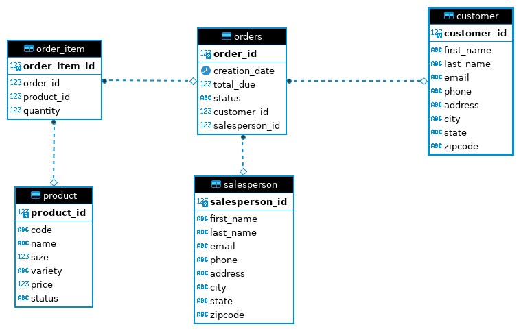

# Introduction

This is a JDBC application. The JDBC allows a connection between a java application and the RDBMS. In this implementation, CRUD (create, read, update, delete) functions 
were added and it is specially connected to a PostgreSQL RDBMS. In addition, a customer Data Access Object was created with this project. The technologies used for this 
are JDBC, PostgreSQL, Maven, DBeaver, and Intellij.

# Implementation
## ER Diagram

## Design Patterns

Data Access Objects:

DAOs are very important as they help provide abstraction between the JDBC and the code. The DAO is usually used to perform the CRUD operations. It does this by using the JDBC API. Since the DAO is our abstraction layer, we also have a DTO (Data Transfer Object) which provides a single domain of data and fully encapsulates objects. The output/input of a single DAO is a single DTO.

Repository:

This pattern focuses on signle table access per class. There will be joining in the code instead of joining in the database.

# Test
I tested the application by using the JDBCExecutor. Of course, PostgresSQL was running using Docker. To view the tables with data, I used DBeaver so it would be easier to follow.
