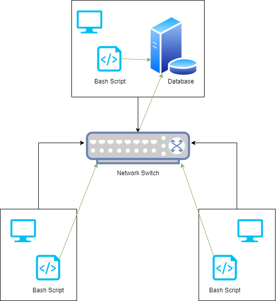

# Introduction
This project is a Linux Cluster Monitoring Agent which is a tool that is used to store each node's hardware specifications as well 
as its updated memory usage in a database. All nodes are connected to each other via a switch which allows the nodes to communicate
with each other through IPv4 addresses. A quick summary is that the project creates a PostgreSQL database, then creates two tables (info and usage), and takes 
the information from the machine then stores it into the tables. The technologies used for this project are: Bash, Docker, Git, PostgreSQL, and Intellij.

# Quick Start
- Start a psql instance using psql_docker.sh
```
./scripts/psql_docker.sh create <username> <password>
./scripts/psql_docker.sh start
```
- Create tables using ddl.sql
```
psql -h localhost -U postgres -d host_agent -f sql/ddl.sql
```
- Insert hardware specs data into the DB using host_info.sh
```
./scripts/host_info.sh localhost 5432 <db_name> <psql_user> <psql_password>
```
- Insert hardware usage data into the DB using host_usage.sh
```
./scripts/host_usage.sh localhost 5432 <db_name> <psql_user> <psql_password>
```
- Crontab setup
```
crontab -e

# Add the line to the open editor to collect the usage data every minute
***** [full file path to]/linux_sql/scripts/host_usage.sh local 5432 [databae] [username] [password]
```

# Implemenation
In terms of implementation, I had to create various files. Those files are `psql_docker.sh`, `host_info.sh`, `host_usage.sh`, `ddl.sql`, `quereies.sql`.
1. Before anything, I created the `psql_docker.sh` script which allows the user to create, start, or stop provisioning a PostgreSQL database. Once created, I had to run the script
to continue the rest of the project.
2. With the database running, I then created the `ddl.sql` which creates two tables in the database which are called host_info and host_usage.
3. Once the tables were created, I created the `host_info.sh` and `host_usage.sh` scripts. These scripts take the hardware specifications and usage information and stores it in its respective tables.
4. Finally, I created `queries.sql` to get more information related to host_info and host_agent such as getting the average memory usage.

Everything was created using Intellij. However, testing was done using the commandline.

## Architecture


## Scripts
* `psql_docker.sh`:
Allows the user to create, start, or stop a provision of a PostgreSQL database using docker.
* `host_info.sh`:
A script that gets the hardware specifications and stores that information into the host_info table on the database.
* `host_usage.sh`:
A script that gets the real-time usage and stores that information into the host_usage table on the database.
* `crontab`:
Runs the host_usage.sh script every minute to get it's real-time information.
* `ddl.sql`:
Creates host_info and host_usage tables in the database.
* `queries.sql`:
Contains queries to get more information from the database such as getting the average memory usage.

## Database Modeling
Describe the schema of each table using markdown table syntax (do not put any sql code)
`host_info`:

| Attribute | Description |
| --- | --- |
| id | Unique identification number. |
| hostname | Unique hostname. |
| cpu_number | The number of CPUs. |
| cpu_architecture | The name of the CPU architecture. |
| cpu_model | Model name of the CPU. |
| cpu_mhz | Clock speed of the CPU. |
| L2_cache | Size of L2 cache of the CPU. |
| total_mem | Size of the total memory of the CPU. |
| timestamp | Time this information was taken. |

`host_usage`: 

| Attribute | Description |
| --- | --- |
| timestamp | Time this information was taken. |
| host_id | Identification number of the host. |
| memory_free | Size of available memory. |
| cpu_idle | Percentage of CPU idle state. |
| cpu_kernel | Percentage of CPU used by the kernel. |
| disk_io | Number of disks performing i/o. |
| disk_available | Size of available disk space. |


# Test
Scripts such as `psql_docker.sh`, `host_info.sh`, and `host_usage.sh` were tested using the secure shell. However, `ddl.sql` and `quereies.sql` were both 
tested using PostgreSQL.

# Deployment
* GitHub - This was used to push features of the project to a remote repository so other users can view this project and try it themselves using the README file.
* Docker - This was used to provision a PostgreSQL database. This helped in terms of testing files that required a database.
* Crontab - This was used to run host_usage.sh every minute in order to gather real-time information in terms of usage.

# Improvements
Write at least three things you want to improve 
e.g. 
- Automatically update hardware information if changed.
- Create a log for any potential error/fails, not only for host_usage.
- Potentially add a feature to get more information such as network and power usage.
